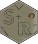

# SWATandR 


[](https://www.tidyverse.org/lifecycle/#maturing)
[](https://doi.org/10.5281/zenodo.3373859)

The `SWATandR` package provides tools to link existing SWAT2012 and SWAT+ models with your modeling workflows in R. `SWATandR` enables you to execute SWAT simulations and to control all relevant parameters of a SWAT simulation, such as changes in model parameters, the simulation periods and time steps, or the simulated variables that should be returned to R. The central goal of `SWATandR` is to return simulation results in a *tidy* format to facilitate an easy implementation of SWAT simulations, together with other R packages into clean and efficient R programming workflows. To efficiently handle large SWAT projects with large numbers of model evaluations and/or large simulation outputs, `SWATandR` provides parallel computation and incremental saving and selective loading of simulation results into and from SQLite data bases.

## Installation

`SWATandR` is still under development and will be constantly updated (particularly to keep up with the newest revisions of SWAT+). You can install the current version of `SWATandR` from the default branch of the package's GitHub repository:


```r
# If you do not have the package devtools installed
install.packages("devtools")

devtools::install_github("Mike-Fuchs/SWATandR")
```

The most recent developments of `SWATandR` are available from the *development* branch of the package's GitHub repository. See the package's [Changelog](https://Mike-Fuchs.github.io/SWATandR/news/index.html) for updates available in the development version. You can install the development version of `SWATandR` available from the *dev* branch as follows:


```r
devtools::install_github("Mike-Fuchs/SWATandR", ref = "dev")
```


<!---You can install the released version of SWATandR from [CRAN](https://CRAN.R-project.org) with:

``` r
install.packages("SWATandR")
```
--->


## Functionality and workflow

The functionality of `SWATandR` is reduced to a few essential functions that maintain the link between the SWAT project on the local hard drive and the R environment. With `load_demo()` you can retrieve demo data sets of SWAT projects, calibration data, and shape files of the demo catchment. To keep `SWATandR` lightweight demo date sets are hosted in the separate package [`SWATdata`](https://github.com/Mike-Fuchs/SWATdata#swatdata-). With `run_swat2012()` and `run_swat2012()` you can run a SWAT model located in a local project folder and return simulation outputs to R that were defined with `define_output()`. Simulation results can be saved incrementally to an SQLite data base when a `save_file` is defined in `run_swat*()`. With `load_swat_run()` all or selected parts of the simulation results stored in the data base can be loaded back to R. `scan_swat_run()` scans the content of saved simulations and returns meta data on the saved content.


## Getting started with `SWATandR`

You can explore the basic functionality of `SWATandR` in the [Get started](https://Mike-Fuchs.github.io/SWATandR/articles/SWATandR.html#loading-demos) section. There you can learn the following basics:

- Loading demo data [>>](https://Mike-Fuchs.github.io/SWATandR/articles/SWATandR.html#figures)
    * SWAT projects [>>](https://Mike-Fuchs.github.io/SWATandR/articles/SWATandR.htmll#swat-projects)
    * Observation data [>>](https://Mike-Fuchs.github.io/SWATandR/articles/SWATandR.html#observation-data)
    * Spatial catchment data [>>](https://Mike-Fuchs.github.io/SWATandR/articles/SWATandR.html#spatial-data)


- Performing first SWAT model runs from R [>>](https://Mike-Fuchs.github.io/SWATandR/articles/SWATandR.html#first-swat-model-runs)
    * Output definition [>>](https://Mike-Fuchs.github.io/SWATandR/articles/SWATandR.html#output-definition)
    * Exploring the first simulation results [>>](https://Mike-Fuchs.github.io/SWATandR/articles/SWATandR.html#exploring-a-simulation)

- Defining parameter modifications for a SWAT run [>>](https://Mike-Fuchs.github.io/SWATandR/articles/SWATandR.html#model-parameter-alteration)
    * Simulation with a single parameter set [>>](https://Mike-Fuchs.github.io/SWATandR/articles/SWATandR.html#simulation-with-a-single-parameter-set)
    * Simulations with many parameter sets [>>](https://Mike-Fuchs.github.io/SWATandR/articles/SWATandR.html#simulations-with-many-parameter-sets)
    * Exploring the outputs when the parameter were modified [>>](https://Mike-Fuchs.github.io/SWATandR/articles/SWATandR.html#exploring-simulations-with-parameter-alterations)

- Saving and loading SWAT simulations [>>](https://Mike-Fuchs.github.io/SWATandR/articles/SWATandR.html#saving-and-loading-simulations)
- Further input arguments of `SWATandR` [>>](https://Mike-Fuchs.github.io/SWATandR/articles/SWATandR.html#further-SWATandR-input-arguments)

The [Articles](https://Mike-Fuchs.github.io/SWATandR/articles/) section is a collection of tutorials for typical topics on SWAT modeling. Here you can learn how to use `SWATandR` in combination with other R packages to perform tasks such as:

- Parameter sensitivity analysis [>>](https://Mike-Fuchs.github.io/SWATandR/articles/par_sensitivity.html)
- Model parameter optimization [>>](https://Mike-Fuchs.github.io/SWATandR/articles/par_optim.html)
- Parameter sampling and model calibration [>>](https://Mike-Fuchs.github.io/SWATandR/articles/par_sampl_calib.html)
- Visualization >>

The Articles section will be updated in the future with further topics that can be relevant for any modeling workflow with `SWATandR`.
